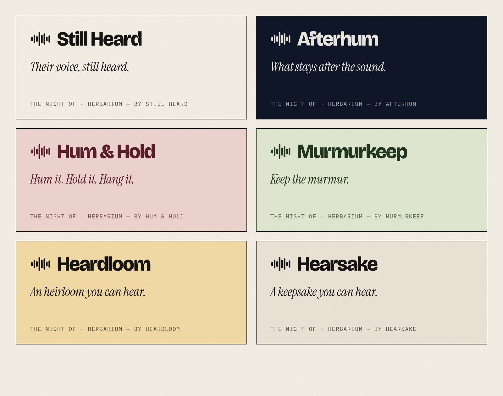

# Brand Name Workshop

**Date:** 28 Sep 2026.
**Why:** "SoundWave Art" is used by an unrelated company in the same category, which has sold "Soundwave Art™" prints since 2012 (`docs/owner-review.md`, D1). We need a name we can own.

## What the name has to do

1. **Say what we are now:** keepsakes made from *your own* recordings. Not "sound wave", which is the commodity term and a competitor's name, and not "song".
2. **Work for grief and for joy.** It has to sit on a memorial print and on a baby's-first-laugh print.
3. **Be ownable.** It should be distinctive enough to trademark, not merely descriptive ("Custom Voice Art" can't be protected), and not already used in art or audio.
4. **Be short and say-able.** It gets said out loud in TikToks, typed after hearing it once, and printed tiny on the back of a frame.
5. **Leave room to grow** beyond the two designs (cards, ornaments, other products).

## Candidates and quick checks

These are web searches only (28 Sep 2026). They are **not** a trademark clearance, and domain availability couldn't be checked from this environment.

| Name | Idea | What the search found | Verdict |
|---|---|---|---|
| **Still Heard** | Their voice is still heard. It also reads as "still" (quiet) + "heard". | No company or shop by that name found in art, prints or keepsakes. | **Recommended.** It's distinctive, emotional without being saccharine, and works for memorial and joy ("still heard, 20 years later"). |
| **Hear It Again** | Echoes the site's QR line "Scan it. Hear it again." | Descriptive and common as a phrase. | Good as a **tagline**, weak as a trademark. |
| **Sound Kept** | The sound, kept. | An Instagram @soundkept exists (unclear what it is), and a US consulting firm called SoundKept. | Possible, but it has neighbours. |
| **Hushmark** | A quiet mark, like a blind stamp (our discreet QR). | Hushmark Press, a California book publisher, owns hushmark.com. | Different category, but the .com is gone. |
| Keepsound | — | A Brazilian audio-equipment retailer (keepsound.com.br). | Avoid (same "sound" space). |
| Heard + Held | — | A Tennessee nonprofit that sends care packages after pregnancy and infant loss. | **Avoid.** It's too close to a sensitive audience we'd share. |
| Anything with *Echo*, *Voiceprint*, *Soundwave* | — | Crowded: Artsy Voiceprint (since 2013) and Bespoken Art (since 2010) are direct competitors. | Avoid. |

## Recommendation

**Still Heard**, with "Scan it. Hear it again." as the tagline.

- **Wordmark:** "Still Heard" set in the display face, with the small waveform glyph we already use as the icon.
- **Sits well with the product names:** "The Night Of by Still Heard", "Herbarium by Still Heard".
- **Tone check:** "I turned my dad's old voicemail into this — Still Heard" reads right. So does "Our first dance, from table six — Still Heard".

## To do before committing to it (free or cheap)

1. **USPTO search** ([tmsearch.uspto.gov](https://tmsearch.uspto.gov/)) for "STILL HEARD" and close variants. Check classes 16 (printed matter, art prints), 20 (frames), 40 (custom printing) and 42 (software).
2. **Domain:** try stillheard.com, then stillheard.co or stillheardstudio.com. Buying one is roughly $10–40 a year, and is your call.
3. **Handles:** @stillheard on TikTok, Instagram, Pinterest and YouTube.
4. **Say it out loud five times,** and ask three people to spell it after hearing it once.

## Switching the site over (about 30 minutes of work once you decide)

The site already reads its name from the environment:
- `NEXT_PUBLIC_BRAND_NAME`
- `NEXT_PUBLIC_APP_URL`
- `NEXT_PUBLIC_SUPPORT_EMAIL`
- `NEXT_PUBLIC_LEGAL_NAME`
- `NEXT_PUBLIC_LEGAL_STATE`

What remains is a find-and-replace of the hard-coded "SoundWave Art" in page titles and copy, a new favicon and OG image, and regenerating the mockups. **Printed QR codes point at `NEXT_PUBLIC_APP_URL`, so settle the domain before the first real order ships.**

Sources:
- [Heard + Held on Instagram](https://www.instagram.com/heardandheld/)
- [Keepsound (Brazil)](https://www.keepsound.com.br/)
- [Sound Kept on Instagram](https://www.instagram.com/soundkept/)
- [SoundKept (RocketReach)](https://rocketreach.co/soundkept-profile_b729a506c43ffb51)
- [Hushmark Press](https://www.hushmarkpress.com/about/)
- [Artsy Voiceprint](https://artsyvoiceprint.com/)
- [Bespoken Art](https://www.bespokenart.com/)

---

## Round 2 — 1 Oct 2026

**How this was checked:** web searches for each exact name (businesses, shops, products, social accounts). Domain and trademark registries are **blocked from this environment**, so "clear" means *no visible business found*, not *available*. The domain and USPTO checks below are still yours to do; both are free.

| Name | Idea | Web search | Say-it / spell-it test | Verdict |
|---|---|---|---|---|
| **Still Heard** | Their voice is still heard | Clear (re-checked) | Passes | **Still the first choice** |
| **Afterhum** | What stays after the sound | Clear | Passes; one made-up word, easy to spell | **Best backup.** Very ownable; leans a little more toward memory than joy |
| **Hum & Hold** | Warm, works for babies and grief | Clear | Passes aloud, but the domain `humandhold.com` reads "human d hold". Use `humholdstudio.com` or `hum-hold.com` | Strong backup |
| **Murmurkeep** | Keep the murmur | Clear | Long, but spells as it sounds | Possible |
| Heardloom | Heirloom you can hear | Clear, but **Heartloom** is a NYC fashion brand (32k Instagram followers) | **Fails:** heard aloud, people type "heirloom" or "heartloom" | Clever on paper; risky in TikToks |
| Hearsake | Keepsake you can hear | Clear | **Fails:** sounds like "hearsay" (gossip, an unreliable account) | Avoid |
| Holdsound | — | Clear | Passes | Plain; fine as a fallback |
| Ever Heard | — | Clear as a business | Common phrase ("have you ever heard…") | Weak trademark, hard to search |
| Unforgot | — | Clear | Reads as a typo | Avoid |
| Heardwell | — | **HearWell** is used by several hearing-aid companies | — | Avoid |
| Kept Voices | — | Descriptive; "voice keepsake" is a crowded search term | — | Avoid |

### Check before choosing (about 15 minutes, free)
1. **Domains:** type each into a registrar search (Namecheap, Porkbun or Cloudflare). Try `stillheard.com`, `afterhum.com`, `murmurkeep.com`, `humholdstudio.com`. If a .com is taken, check whether anything is actually built on it before settling for .co or .studio.
2. **Trademark:** [tmsearch.uspto.gov](https://tmsearch.uspto.gov/). Search the words with and without the space, in classes 16, 20, 40 and 42.
3. **Handles:** the same name on Instagram, TikTok and Pinterest.
4. **Ear test:** say it to three people and ask them to type it.

Sources (round 2):
- [Heartloom on Instagram](https://www.instagram.com/heartloom/)
- [HearWell Group (OTC hearing aids)](https://www.einpresswire.com/article/718230800/hearwell-group-unveils-advanced-over-the-counter-hearing-aids-for-hearing-health)
- [Hearwell Ltd (Widex shop listing)](https://widex.com/en-gb/shop-finder/shop-details/gb/hr4-0ed/hereford/hearwell-ltd/afde4bfb-4ae6-4a8d-b7d1-2a58f7a898fa)
- [Voice recording keepsake (Beyond Memories)](https://beyond-memories.com/blogs/beyond-memories/voice-recording-keepsake)
