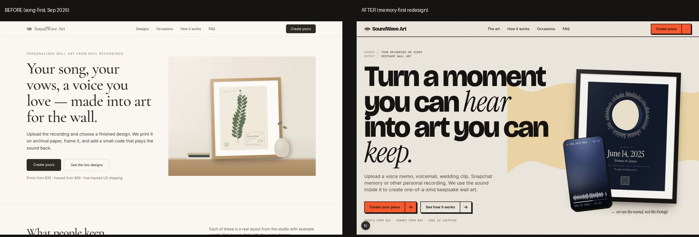

# Owner Review — Memory Pivot + 2026 Redesign

**Branch:** `claude/intelligent-fermi-n7ian7`. **Date:** 28 Sep 2026.

**Nothing has been deployed.** No money was spent and no campaigns were created.

Related:
- `docs/memory-audio-pivot-audit.md` (what was wrong before)
- `docs/video-upload-support.md`
- `docs/seo-memory-positioning.md`
- `docs/content-strategy-q4-2026.md` §0 (new hooks)

---

## 1. Positioning: old vs new

| | Old | New |
|---|---|---|
| One-liner | "Your song, your vows, a voice you love — made into art for the wall." | "We turn the sound from your personal recordings and videos into premium keepsake wall art." |
| Homepage H1 | same as above | "Turn a moment you can *hear* into art you can *keep.*" |
| Hero subhead | "Upload the recording and choose a finished design…" | "Upload a voice memo, voicemail, wedding clip, Snapchat memory or other personal recording. We use the sound inside it to create one-of-a-kind keepsake wall art." |
| Samples | "At Last — Etta James", "Pressed from the song we danced to." | "Our vows, from the wedding video", "Recorded from the second row by her brother." |
| Role of songs | The source of the art | **Optional context only.** A small printed line, and optionally the QR destination. |
| Wedding page | `/wedding-song-art` "The song you danced to…" | `/wedding-vows-art` "Your vows, exactly as they sounded that day." (old URL 308-redirects) |

Screenshot: `docs/review/redesign-2026/before-after-home.jpg`

## 2. Final key copy (live on the branch)

- **Hero:** "Turn a moment you can hear into art you can keep." / "← we use the sound, not the footage"
- **Transformation:** "From a clip on your phone to a print on your wall." Steps: Your video / voice note / recording → We extract the moment → It shapes your artwork → We print + frame it.
- **Examples** (labelled "Demo examples — illustrative people and recordings, not customer orders"): Maya + Jordan (wedding video), Walter (saved voicemail), Juniper (phone video of a dog).
- **What can become art?** "a saved voicemail / wedding vows / a Snapchat memory / a baby's laugh / a dog's bark / a proposal clip / Grandma singing / a voice note / an original recording"
- **Song line:** "A song may remind you of the moment. Your recording is the moment."
- **QR:** "Scan it. Hear it again." Option A (default) plays your recording from a private link. Option B opens a link you choose. "The link is only where the code points. We never download or analyse it — your artwork is made from the file you upload."
- **Rights checkbox (required to order):** "I made this recording or have permission to use it."
- **Herbarium explanation:** "We measure how loud your recording is from its first second to its last. Each leaf's length is the loudness at that moment, root to tip — so the plant is grown from your recording, not chosen from a preset."
- **Footer:** "Keep the sound of it."

## 3. Supported formats

**Video:** MP4, MOV, M4V, WebM, 3GP. **Audio:** M4A, MP3, WAV, AAC, OGG, FLAC, WebM. You can also record in the browser. Limits are 400 MB and **3 minutes**.

## 4. Is video upload implemented?

**Yes.** The browser pulls the soundtrack out of the video, and **only the sound is uploaded**; the footage never leaves the phone. There are clear errors for:
- no audio track or a silent file
- unsupported type
- a file that's too large or too long
- a corrupt file
- network and server failures (with retry)

Details and test results are in `docs/video-upload-support.md`.

⚠ **Please test one real iPhone `.mov` and one Android `.mp4` on real phones before launch.** Our automated browser has no AAC codec, so those two formats were verified by reasoning about browser support, not end to end. WebM video was verified end to end, through to a created order.

## 5. How the QR code and listen link work

- Every order gets a random private token. The printed code encodes `https://<site>/l/<token>`, a short URL that is the same length whatever the destination, so the discreet code stays small.
- **Option A (default):** `/l/<token>` shows a simple page that plays the uploaded recording.
- **Option B (customer's link):**
  - `/l/<token>` **redirects** to the Spotify, Apple Music, YouTube or other `http(s)` link the customer pasted.
  - Our server never fetches or analyses that URL. It's validated for shape only: http/https, no embedded credentials, max 500 characters (`src/lib/listenLink.ts`).
  - `/l/<token>?recording` still plays the uploaded recording.
- Because the code points at our domain, **a wrong link can be fixed after printing** by editing `artworkSpec.listenUrl` on the order.
- QR styles: Discreet (tone-on-tone, 30% contrast; verified to scan, `npm run test:qr` 14/14), Standard, or None.

## 6. Song claims removed or changed

Every ⚠ row in `docs/memory-audio-pivot-audit.md` §2 was addressed:
- site title and description
- homepage H1, examples and alt text
- Herbarium and Night Of samples (now vows from a video; `sampleKind: voice`)
- occasion prompts in `src/lib/catalog.ts` (no more "Upload the song (an MP3…)")
- the wedding page (rewritten and renamed)
- the anniversary page, FAQ, Footer and studio copy ("a whole song" removed)
- content concepts c02, c03, c06 and c09

The studio has a separate, optional "The song behind the memory" field. It's printed as a context line and never used as audio.

**Still song-led (not yet fixed):** legacy `/gifts/*` pSEO pages, most of which are noindex/canonicalised. See `docs/seo-memory-positioning.md` §4.

## 7. Legal / privacy — decided 28 Sep 2026

| # | Question | Decision | Where it lives |
|---|---|---|---|
| 1 | Terms and Privacy | Claude drafted both; no lawyer review for now | `/terms`, `/privacy`; linked in the footer, sitemap and next to the Order button |
| 2 | Retention | Recordings behind a QR code are kept for as long as the business runs. Without a code: deleted 90 days after delivery. Cancelled orders, abandoned checkouts and uploads never ordered: deleted after 30 days. | `src/lib/retention.ts` (tested). Run `npm run uploads:cleanup` (dry run), then add `-- --apply` on a daily schedule on the NAS. |
| 3 | Background music in personal videos | Accepted | Terms §2, proposal and wedding pages |
| 4 | Takedowns | Remove on request, no questions asked | `npm run uploads:remove -- <orderId or token> --apply` deletes the file. The QR page then says "This recording has been removed" and the audio returns 410. |
| 5 | Brand name | Workshopped | `docs/brand-name-workshop.md`. Recommendation: **Still Heard**. |

**Commitments the drafted policies make on your behalf.** Change the pages if any of these are wrong:
- Free changes or cancellation until production, which starts within about one business day.
- A 30-day window to report damage or our mistakes; the customer chooses a reprint or a refund.
- A typo that was in the approved preview is reprinted at cost.
- Removal requests are handled within two business days.
- If the business ever closes, customers are emailed first with a way to download their recordings.
- Governing law is "the US state where we are registered" until `NEXT_PUBLIC_LEGAL_STATE` is set. `NEXT_PUBLIC_LEGAL_NAME` sets the legal entity name.

**Storage estimate:** with the 3-minute cap and re-encoding, each recording is at most about 10 MB (usually 1–8 MB). A 1 TB NAS holds roughly 100,000 recordings.

**Still open:** the brand-name trademark search and domain (see the workshop doc), and pointing a nightly job at `uploads:cleanup --apply`.

## 8. Redesign: what changed and why

**Reference study.** The Shopify Editions Winter '26 and similar sites (awwwards, Codrops, paper.design, Nomu) were **blocked by this environment's network policy**. The direction came from your two screenshots (Aardvark, Decathlon Yestalgia) and published descriptions of the sites.

**What we took from them:**
- **Aardvark:** a saturated colour field, huge heavy grotesk type, organic blob shapes, tactile CTAs with an arrow compartment.
- **Decathlon:** stacked caps, collage stickers with hard black shadows.
- **Shopify Editions:** each section is its own "world".

**What we deliberately didn't copy:** their loudness. This is a grief-and-love product, so the colour stays warm and paper-based, and the loud moments are rationed.

The system:
- **Type:**
  - Bricolage Grotesque at 800 weight for the large headlines.
  - Instrument Serif italic as the emotional accent ("hear", "keep", "moment").
  - IBM Plex Mono for file metadata ("SOURCE / WEDDING VIDEO").
  - Inter for UI.
- **Colour worlds:**
  - paper (default)
  - film (the transformation)
  - night (The Night Of)
  - botanical (Herbarium)
  - romantic (the song line)
  - signal orange (the final CTA)
- **Brand motif:** the waveform. It appears as section edges (`WaveEdge`), the organic hero blob (`MemoryTrace`), and bars and playheads on the phone clips.
- **Phone media as an asset:** `PhoneMemory` renders a stylised camera-roll clip (filename, REC dot, waveform, playhead), so the source → artwork story reads without real footage.
- **Tactile UI:** 2px ink borders, 4px hard shadows, buttons that press down, and a paper-grain overlay.
- **Motion:** draw-on waveforms, a playhead, gentle float and scroll reveals. All of it is disabled under `prefers-reduced-motion`.
- **Studio:**
  - Five steps: Memory → Artwork → Details → Print → Review.
  - Desktop: a sticky live preview on the left, controls on the right.
  - Mobile: collapsible preview, plus a fixed Back / price / Next bar.
  - Explicit upload states.

Screenshots (`docs/review/redesign-2026/`):

| Page | File |
|---|---|
| Homepage 1440 (full) | `home-1440.jpg` |
| Homepage 375 (full) | `home-375.jpg` |
| Homepage 768 fold | `home-768-fold.jpg` |
| Studio 1440 / 375 | `create-1440.jpg`, `create-375.jpg` |
| The art | `designs-1440.jpg` |
| Wedding vows | `vows-1440.jpg` |

**QA done (Playwright, 28 Sep 2026):**
- 8 pages × 375/768/1440: **no horizontal overflow, no console errors, no interactive target under 44px.** 375 was run with reduced motion on.
- Upload → order flow verified end to end (silent video rejected; a real video became an order with its real peaks).
- The listen link redirects; `?recording` plays the recording.
- `npm run build` passes; typecheck is clean. Suites:
  - verify 55/55
  - art engine 282/282
  - curated checkout 29/29
  - discreet QR 14/14
  - frontend store 29/29
  - Python suite 44/44

## 9. Decisions (answered 28 Sep 2026)

1. Headline "Turn a moment you can hear into art you can keep." ✓ approved
2. Default QR: Discreet, playing the recording ✓
3. Listen link: kept for all orders (it was asked for in the pivot brief) ✓
4. Retention ✓ (§7)
5. Legacy pages ✓
   - The three indexable `/gifts` pages (baby heartbeat, first laugh, proposal) were rewritten on the new template at the same URLs.
   - Every other `/gifts/*` URL, `/gifts` and `/shop` now 308-redirect to their current equivalent.
6. Upload limit: **3 minutes** ✓

## 10. What still needs real assets, content or backend work

- **Real product photography.** Every "framed" image is a rendered mockup; the phone clips are stylised illustrations. Shoot one Night Of and one Herbarium print in real frames, plus real phone-in-hand shots.
- **Real customer stories, with permission,** to replace the three demo examples. **No testimonials have been written or invented.** The homepage demo block is labelled as such.
- **The print supplier** is still unconfirmed (paper, frame specs, turnaround in the copy are the plan, not a contract).
- **Payments are not connected.** Orders stop at `pending_payment` with `?preview_checkout=1`. The fulfillment path still needs a production Postgres (the blocker from the earlier review).
- **Schedule the clean-up job** and pick the legal entity and state (§7).
- **Real-device video test** (§4).
- **The brand name / trademark** check.
