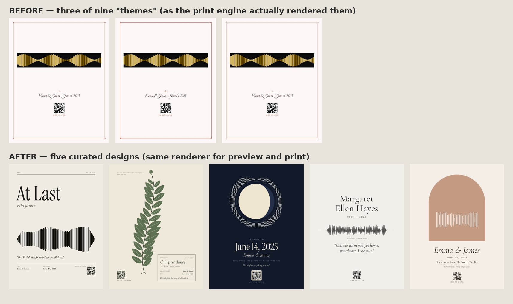

# Owner Review — read this first

**Date:** 28 Sep 2026 · **Branch:** `claude/intelligent-fermi-n7ian7` · Nothing has been deployed, no money spent, no campaigns created.

---

## 0. Pivot (28 Sep 2026, owner decision): The Night Of + Herbarium only

The store now sells **two designs**, which scored highest in the critique and are the most distinctive:

- **The Night Of** — the real moon for the customer's date, ringed by their recording.
  Colourways: Midnight, Dawn, Plum Night.
- **Herbarium** — a pressed botanical whose leaf lengths are drawn from the recording.
  Colourways: Herbarium, Blush, Cyanotype, plus a new **Stone** colourway for memorial and pet orders.

**What happened to the other three designs.** Liner Notes, The Arch and In Memoriam are **retired, not deleted** (`RETIRED_DESIGNS` in `src/lib/art/index.ts`):

- They still render, so any existing order still prints.
- They're visible in the internal gallery (`/dev/designs`).
- Bringing one back is a one-line change.
- Old links (`?design=liner-notes`, `?template=…`) land on the nearest current design.

**Every occasion now maps to one of the two:**

| Occasion | Design |
|---|---|
| Wedding song, memorial, baby, pet | Herbarium (Stone for memorial and pet, Blush for baby) |
| The night we met, wedding night / vows, anniversary | The Night Of |

Homepage, designs page, intent pages, FAQ and mockups were all updated to match.

**Trade-off to watch.** Memorial buyers lose the purely typographic In Memoriam. Herbarium Stone is gentler but more decorative. If memorial becomes a big share of orders and feedback asks for "just their name and voice", bring In Memoriam back.

### Hidden QR codes: what's possible

- **Cryptography doesn't hide a code.** The link is already cryptographically protected: each print gets a random 96-bit token (`/l/<token>`), so nobody can guess or enumerate other people's recordings.
- **What "hiding" can mean in practice:**

| Option | Status | Notes |
|---|---|---|
| **Discreet tone-on-tone code** (new default) | **Built** | The code is printed as a faint shade of the paper colour with no caption, like a blind stamp. Studio offers *Discreet* / *Standard* / *None*. Tested: 14/14 decode after simulated phone-photo degradation (blur, noise, uneven light, JPEG) with ZXing (`npm run test:qr`); ZXing still decoded down to ~14% contrast, and we print at 30% for margin. **Must be confirmed on a physical print with iPhone and Android cameras before launch.** |
| Code on the back of the frame / a separate card | Possible later | Needs the print partner to add a label or insert. Most POD partners don't; would need own packing. |
| NFC tag in the frame (tap phone to play, no visible mark) | Possible later | ~$0.20–0.50 per tag; iPhone and Android read URL tags natively. Needs manual insertion, so not compatible with pure dropshipping. |
| Invisible watermark (Digimarc-style) | Not recommended | Requires a special app to read, which defeats "just point your camera". |

## 1. Old vs new

| | Before | After |
|---|---|---|
| Artwork | [old print previews](review/old/old_print_previews.jpg) | [all designs, contact sheet](review/designs/contact-sheet.jpg) |
| Homepage | [old](review/old/home.png) | [new](review/new/home.png) · [mobile](review/new/home-mobile.png) |
| Configurator | [old](review/old/customizer.png) | [new, with a real recording](review/new/studio-with-real-audio.png) · [mobile](review/new/create-mobile.png) |
| Product mockups | none | [`public/mockups/`](../public/mockups/): hero, one wall scene per design, six occasion examples |
| Intent page | none | [voicemail memorial](review/new/voicemail-memorial-art.png) |

## 2. Final proposed product lineup

**After the pivot (§0), only The Night Of and Herbarium are sold.** The table below is the original five-design lineup, kept for reference. Details and critique: [art-direction-2026.md](art-direction-2026.md).

| Design | Direction | Best for | Colourways |
|---|---|---|---|
| **Liner Notes** | Editorial | first dance, music lovers | Bone & Ink, Ink & Bone, Clay |
| **The Arch** | Keepsake (optional photo) | vows, anniversary | Terracotta, Sage, Dusk |
| **Herbarium** | Botanical (leaves drawn from the recording) | anniversary, baby, gentle gifts | Herbarium, Blush, Cyanotype |
| **The Night Of** | Celestial (true moon phase for the date) | the night we met, anniversary | Midnight, Dawn, Plum Night |
| **In Memoriam** | Memorial | voicemail, parent, pet | Stone, Linen, Slate |

**Formats and prices** (provisional; see [unit-economics.md](unit-economics.md)):

| Size | Print only | Framed |
|---|---|---|
| 8×10 | $35 | $69 |
| **12×16** (default) | **$49** | **$99** |
| 18×24 | $65 | $149 |

- Frames: black, natural oak, white.
- Free tracked US shipping.
- Scan-to-listen QR: Discreet (default), Standard or None.

## 3. Major changes (in commits)

1. **Artwork engine** (`src/lib/art/`). One TypeScript renderer draws both the live preview and the print file:
   - Vector PDF at exact physical size, with fonts embedded.
   - Text fitted with real font metrics.
   - QR codes verified to decode for every design, colourway and size.
2. **New studio** at `/create` (`/product/custom` still works):
   - Choose design (or start from an occasion) → recording → words → size and finish → order.
   - Accepts M4A (iPhone voicemails) and phone videos.
3. **Homepage rebuilt** around finished-product imagery; `/designs`; four search-intent pages; a voicemail-saving guide; sitemap and robots; thin programmatic pages noindexed.
4. **Checkout:**
   - Validates everything server-side and stores the artwork spec.
   - Each order gets a private listen link (`/l/<token>`) behind its QR code. The old QR pointed to a non-existent page.
5. **Fulfilment:** `backend/fulfill.py` renders curated orders through the same renderer.
6. **Trust fixes:**
   - Removed the fabricated "4.97 / 840+ verified purchases" reviews and the unverifiable material claims.
   - The Stripe webhook no longer accepts the public test secrets in production.
7. **Analytics:** first-party funnel log, GA4, Meta and TikTok pixels behind consent, and server-side purchase events.
8. **Email capture:** footer form → `Subscriber` table.
9. **Docs:**
   - [current-product-audit](current-product-audit.md)
   - [competitor-research-2026](competitor-research-2026.md)
   - [art-direction-2026](art-direction-2026.md)
   - [positioning](positioning.md)
   - [unit-economics](unit-economics.md)
   - [analytics-plan](analytics-plan.md)
   - [content-strategy-q4-2026](content-strategy-q4-2026.md)
   - [paid-acquisition-q4-2026](paid-acquisition-q4-2026.md)
   - [q4-launch-calendar](q4-launch-calendar.md)

**Tests** (all passing locally against a local Postgres):

| Suite | Result |
|---|---|
| `npm run build` | ✅ |
| `npm run test:all` | 40 + 55 + 530 checks ✅ |
| `npm run test:checkout` | 16 ✅ |
| `python tests/run_all_tests.py` | 44/44 ✅ |

Seven old frontend checks asserted the removed border picker, the old `/shop` filters and the unverifiable "300 DPI / solid wood" copy. They were **rewritten to assert the new equivalents**, not deleted (commit `e01e5aa`).

## 4. Decisions only you can make

| # | Decision | My recommendation | Why it matters |
|---|---|---|---|
| **D1** | **Brand name and domain.** `soundwaveart.com` is owned by an unrelated company that has sold "Soundwave Art™" prints and jewellery since 2012 ([their site](https://soundwaveart.com/)). The ™ suggests they claim unregistered rights, and they're in exactly our category. | **Choose a different name before launch** and get a quick trademark knockout search (USPTO [search](https://tmsearch.uspto.gov/)) or a lawyer's opinion. The code now reads the name, URL and support email from env (`NEXT_PUBLIC_BRAND_NAME`, `NEXT_PUBLIC_APP_URL`, `NEXT_PUBLIC_SUPPORT_EMAIL`), but the visible "SoundWave Art" wordmark and copy still need a find-and-replace once a name is chosen. | Confusion or passing-off risk; social handles and SEO equity should build under a name you can keep. The footer email previously pointed at *their* domain. |
| D2 | Print partner | **Prodigi** (already integrated; framed prints with mounts) *or* Printful/Gelato (not integrated). Get quotes for all three. | Sets cost, quality and holiday cutoffs |
| D3 | Final prices | Keep the table above if framed 12×16 lands at ≤ $60 including shipping; otherwise raise framed 12×16 to $109–119 | Break-even CAC ≈ $34 at current estimates |
| D4 | **Hosting architecture** (launch blocker, §6) | One small container host (Railway, Fly.io or Render) running Next.js with Chromium, plus Supabase Postgres and Storage, and a Node fulfilment worker | Vercel can't run the Python/Chromium pipeline or keep uploaded files |
| D5 | How long the recording stays playable | Promise **"for as long as we operate, and you can download it any time"**, and add a download link on the listen page | Customers will ask; the old copy promised "forever" |
| D6 | Returns policy | Reprint free for damage or our error; no change-of-mind returns on personalised items (as written in the FAQ) | Standard for personalised goods; must also appear in the Terms page |
| D7 | Digital download option ($15–19)? | **Not for launch.** Adds a cheap substitute for the framed print; revisit after launch | Protects AOV |
| D8 | International shipping | **US only** for Q4 (curated checkout restricts to US) | Holiday cutoffs and costs are US-modelled |
| D9 | Offers | No standing discounts; BFCM "framed for print + $30" on 12×16 (q4-launch-calendar) | Margin |
| D10 | Memorial content on social | Only with family permission or your own recordings | Ethics, and trust |

## 5. Anything that costs money

All amounts are **estimates**. Nothing has been bought.

| Item | Est. cost | When |
|---|---|---|
| Samples: 5 framed 12×16 (one per design) + 2 print-only | $250–400 incl. shipping | Week of Sep 28 |
| Domain for the new brand | $10–40/yr | Before launch |
| Hosting (container + Postgres + storage) | $20–70/mo | Before launch |
| Trademark knockout / lawyer opinion | $0 (DIY search) to $300–600 | Before launch |
| Paid tests (optional, gated) | $100 → $250 → $500 | Oct 20 – Dec 8, only if the conditions in the paid doc are met |
| Creator seeding (optional) | ~$60 product cost per creator | November |
| Stripe fees | 2.9% + 30¢ per order | Ongoing |

## 6. Launch blockers (engineering)

1. **Fulfilment can't read orders from Postgres.** `backend/fulfill.py` only speaks SQLite. The curated render step works (tested), but the script can't load a Supabase order.
   - **Fix options:**
     - (a) Port fulfilment to a Node worker that reads via Prisma, calls `scripts/render-art.ts`, and submits to the print partner's REST API. Recommended: one language and one data layer.
     - (b) Add `psycopg` to the Python script.
   - Either is 1–2 days of work.
2. **Hosting and storage.**
   - Uploads, PDFs and previews are written to local `storage/`, which is lost on serverless or container redeploys. Move them to Supabase Storage or S3.
   - Serve `/api/listen/*` from there.
   - Chromium must be available where print files are rendered (already true for the Python engine).
3. **Legal pages:** privacy policy (audio recordings, email, analytics consent), terms of sale, shipping and returns. These pages don't exist yet; the old footer linked to non-existent ones and those links were removed.
4. **Supplier SKUs:** placeholders in `src/lib/catalog.ts` (`sku.prodigi`) and the size mapping in `backend/print_partner.py` must match the chosen products (12×16 and 18×24 are new sizes).
5. **Brand name** (D1).

## 7. External credentials needed

| Service | Env vars | Used for |
|---|---|---|
| Supabase / Postgres | `DATABASE_URL`, `DIRECT_URL` | Orders, events, subscribers. Run `prisma/migrations/20260928_curated_designs/migration.sql` or `npx prisma db push` |
| Stripe | `STRIPE_SECRET_KEY`, `STRIPE_WEBHOOK_SECRET`, `NEXT_PUBLIC_STRIPE_PUBLISHABLE_KEY` | Checkout + `checkout.session.completed` webhook |
| Print partner | `PRODIGI_API_KEY` or `PRINTIFY_API_KEY` + `PRINTIFY_SHOP_ID` | Order submission |
| Resend | `RESEND_API_KEY`, `RESEND_FROM_EMAIL` | Confirmations, cutoff reminders |
| GA4 | `NEXT_PUBLIC_GA4_ID`, `GA4_API_SECRET` | Analytics |
| TikTok | `NEXT_PUBLIC_TIKTOK_PIXEL_ID`, `TIKTOK_EVENTS_TOKEN` | Pixel + Events API (before paid tests) |
| Meta | `NEXT_PUBLIC_META_PIXEL_ID`, `META_CAPI_TOKEN` | Only for retargeting tests |
| Site | `NEXT_PUBLIC_APP_URL`, `NEXT_PUBLIC_SUPPORT_EMAIL`, `NEXT_PUBLIC_BRAND_NAME` | Links, QR URLs, emails |

## 8. Exact next actions, in order

1. Read §1 and the contact sheet. Decide whether you like the five designs; say which to cut or push. Renders regenerate with `npm run art:gallery`.
2. **Decide the brand name (D1).** Claim the domain and social handles.
3. Get quotes from Prodigi, Printful and Gelato for the six SKUs (unit-economics §6). **Order the samples.**
4. Choose hosting (D4). Then either I or a developer fix blockers 1–2 (§6) and add the legal pages.
5. Set up Stripe in test mode + webhook; do one full test order through to a printed sample.
6. Add GA4; run the analytics validation checklist.
7. Start posting (content-strategy §6, first two weeks) while samples ship. Screen-recording concepts need no samples.
8. When samples arrive: photograph them, test QR scans on three phones, and replace or augment mockups with real photos.
9. Switch Stripe to live. Soft-launch to friends and family and ask for honest reviews **after delivery** (`src/lib/reviews.ts`).
10. Follow [q4-launch-calendar.md](q4-launch-calendar.md). Paid spend only when its gate conditions are met.

## 9. Launch readiness checklist

**Product**
- [x] Five finished designs; preview == print; vector PDFs at exact size
- [x] QR codes decode across all designs, colourways and sizes (ZXing 45/45 at 100 px/in)
- [ ] Physical sample of every design checked for colour, paper and frame
- [ ] QR scanned from a physical print on iPhone and Android

**Commerce**
- [ ] Brand name and domain decided (D1)
- [ ] Supplier chosen, SKUs mapped, costs entered
- [ ] Stripe live; webhook secret set; test order printed and delivered
- [ ] Fulfilment reads Postgres (blocker 1); storage off local disk (blocker 2)

**Site**
- [x] Homepage, designs, intent pages, voicemail guide, sitemap
- [ ] Privacy policy, terms and returns pages
- [ ] Holiday cutoff dates confirmed with the supplier (site says Dec 10 framed)
- [ ] Real product photos added

**Measurement**
- [x] Funnel events implemented (first-party + GA4, Meta, TikTok, server-side)
- [ ] GA4 ID set and DebugView validated
- [ ] TikTok pixel + Events API validated (before any paid test)

**Marketing**
- [ ] Social handles live; first 14 videos posted
- [ ] Email sending domain verified; subscribers receiving the Dec 3 and Dec 9 reminders
- [ ] Real reviews only; review request email after delivery
